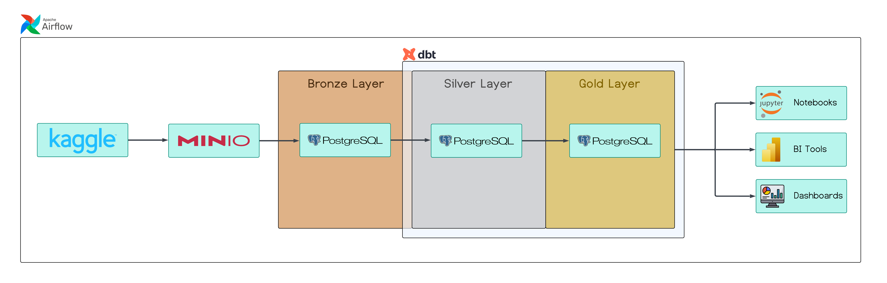

# Olist Lakehouse

Este projeto constrói um **Lakehouse** para o ecommerce [Olist](https://olist.com/home/), utilizando a **[Arquitetura Medallion](https://learn.microsoft.com/en-us/azure/databricks/lakehouse/medallion)**, que organiza os dados nas camadas **bronze**, **silver** e **gold**.

O objetivo é demonstrar como estruturar um pipeline de dados moderno, desde a ingestão de dados brutos até a modelagem dimensional, pronto para análises e BI.

---

## 🏗️ Arquitetura

A arquitetura segue o conceito de **Lakehouse**, que combina as melhores características de data lakes e data warehouses.

**Camadas:**
- 🥉 **Bronze:** dados brutos, exatamente como foram extraídos do Kaggle.
- 🥈 **Silver:** dados limpos, tratados e integrados.
- 🥇 **Gold:** modelo dimensional (tabelas `dim_*` e `fct_*`), pronto para consumo analítico.



---

## 🔄 Pipeline de Dados

1. **Ingestão:**  
   Airflow (via [Astro](https://www.astronomer.io/product/)) orquestra a extração dos dados do [Kaggle](https://www.kaggle.com/datasets/olistbr/brazilian-ecommerce), armazena no [MinIO](https://min.io/) (Data Lake) e depois carrega no [PostgreSQL](https://www.postgresql.org/) (camada bronze).

2. **Transformação:**  
   O [dbt](https://www.getdbt.com/) aplica as transformações necessárias para gerar as camadas **silver** e **gold** dentro do PostgreSQL.

3. **Consumo:**  
   Os dados na camada gold estão prontos para análises em ferramentas de BI, notebooks, dashboards, etc.

---

## 🚀 Inicialização

Clone o repositório e execute:

```bash
git clone ...
cd olist_lakehouse
docker-compose up -d
cd astro-airflow
astro dev start
