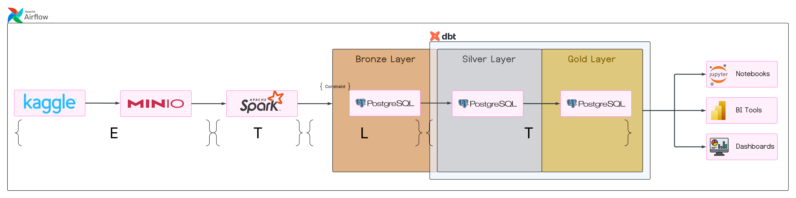
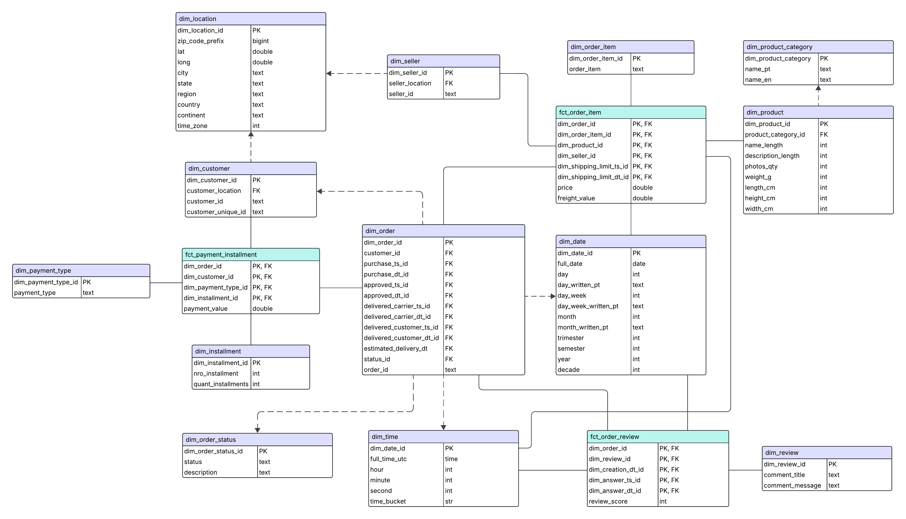

# Olist Lakehouse

Este projeto constrói um **Lakehouse** para o ecommerce [Olist](https://olist.com/home/), utilizando a [Arquitetura Medallion](https://learn.microsoft.com/en-us/azure/databricks/lakehouse/medallion), que organiza os dados nas camadas **bronze**, **silver** e **gold**.

O objetivo é demonstrar como estruturar um pipeline de dados moderno, desde a ingestão de dados brutos até a modelagem dimensional, pronto para análises e BI.

---

## 🏗️ Arquitetura

A arquitetura segue o conceito de **Lakehouse**, que combina as melhores características de data lakes e data warehouses.

**Camadas:**
- 🥉 **Bronze:** dados brutos, exatamente como foram extraídos do Kaggle.
- 🥈 **Silver:** dados limpos, tratados e integrados.
- 🥇 **Gold:** modelo dimensional (tabelas `dim_*` e `fct_*`), pronto para consumo analítico.



---

## 🔄 Pipeline de Dados

1. **Ingestão:**  
   Airflow (via [Astro](https://www.astronomer.io/product/)) orquestra a extração dos dados do [Kaggle](https://www.kaggle.com/datasets/olistbr/brazilian-ecommerce), armazena no [MinIO](https://min.io/) (Data Lake) e depois carrega no [PostgreSQL](https://www.postgresql.org/) (camada bronze).

2. **Transformação:**  
   O [dbt](https://www.getdbt.com/) aplica as transformações necessárias para gerar as camadas **silver** e **gold** dentro do PostgreSQL.

3. **Consumo:**  
   Os dados na camada gold estão prontos para análises em ferramentas de BI, notebooks, dashboards, etc.

---
## ⚙️ Configuração

O projeto foi construído de que praticamente todas as configurações possam ser definidas nos arquivos Docker. 

Entre elas, nota-se principalmente configurações de autenticação, como username e password.

Uma que merece atenção especial é o **diretório .dbt**:
- É necessário alterar, conforme necessário, o caminho do .dbt de acordo com a localização no seu dispositivo. No `docker-compose.yml`, ele está definido como `C:/Users/User/.dbt`, pois era a localização para o desenvolvedor.  

---

## 🚀 Inicialização

Para adicionar esse repositório, execute:
```bash
git clone https://github.com/gabfxv/olist-lakehouse
cd olist-lakehouse
python -m venv .venv
source activate .venv
```

É necessário o Docker para rodar o projeto.
Caso não o tenha instalado, baixe por [aqui](https://docs.docker.com/engine/).

Para baixar o DBT, é necessário executar (ou o comando equivalente em Windows):
```bash
pip install -r requirements.txt
mkdir -p ~/.dbt
```

Para subir o PostgreSQL, MinIO e o DBT Docs, execute:
```bash
docker-compose up -d
```

Para iniciar o Astro/Airflow, primeiro instale ele [aqui](https://www.astronomer.io/docs/astro/cli/install-cli/#install-the-astro-cli) e então, execute:
```bash
cd astro-airflow
astro dev start
```

Para iniciar o OpenMetadata, execute:
```bash
cd openmetadata
docker compose -f docker-compose-postgres.yml up -d
```

Os seguintes serviços estão acessíveis a partir destas URLs:
- **Astro**: http://localhost:8080
- **Minio**: http://localhost:9001
- **DBT Docs**: http://localhost:8081
- **OpenMetadata**: http://localhost:8585/

## 🗂️ Modelagem de Dados

A Gold layer segue o seguinte diagrama:



